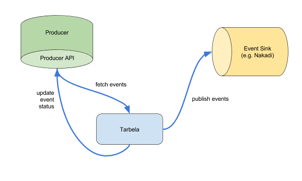

# Tarbela

Tarbela is a reliable generic event publisher.

## Which problem does this solve?

In a microservice architecture, some types of events need to be sent (to an event consumer application, or to some event bus which distributes it to the consumers) whenever some data is changing. If sending the event at the same time as updating the data in the database, we have the distributed transaction problem: Do we first send the event or first commit the change to the database? In either case we get problems when the second one fails for some reason.

## How does this work?

Our approach here is that the event producer commits both the event and whatever data change caused the event in the same transaction to the same database (but usually different tables). Then Tarbela (which is a separate application) fetches those events, tries to publish them to the event sink, and if that publishing was successful, informs the producer about the success (so the same event doesn't get sent again the next time).

The Producer needs to implement a Tarbela-specific "Event producer API" (defined in this project as [an OpenAPI definition](src/main/resources/api/event-producer-api.yaml)).
For each type of event sink, Tarbela knows those sink's API. *(Note: Currently just [Nakadi](https://github.com/zalando/nakadi) is supported, but other sinks are planned to be added.)*

Tarbela's configuration lists all the producers and sinks with their types, URLs and needed authentication (i.e. which OAuth scopes need to be present in tokens to be sent there). *(Note: Currently we just support one Producer and one Consumer. We still have to figure out how to configure multiple ones.)*

Tarbela itself has no (mutable) state.

## What do I need to configure?

Tarbela needs some pieces of configuration to do its job. If you are using the pre-built docker image (or a building the image as described below) or running directly with Java, you can pass those as environment variables (you can replace the `.` with `_`, as many OSes don't support dots: `tokens_accessTokenUri=https://...`). You can also pass the properties as command line arguments (like `--tokens.accessTokenUri=https://...`) or Java system properties (`-D tokens.accessTokenUri=https://...`.

You can also pass all the properties as a JSON data structure, using the `--spring.application.json` command line argument or `SPRING_APPLICATION_JSON` environment variable. *(TODO: add example.)*

If you build your own image, you can configure the properties in a Spring YAML config file, like the [application-example.yml](src/main/resources/config/application-example.yml).

Tarbela currently is supposed to run on the [STUPS platform](https://stups.io/) on AWS. *(TODO: figure out how much of this actually depends on STUPS, and if we can support non-STUPS alternatives.)*

Setting | Description | Property name
--------|----------------------|--------------
Access Token URI | The Authentication Server URI where Tarbela can obtain OAuth2 access tokens for accessing the resource server. | tokens.accessTokenUri
Token Info URI | The Authentication Server URI where Tarbela can check which scopes an OAuth Token actually has. *(TODO: is this actually necessary?)* | tokens.tokenInfoUri
Credentials Directory | A directory where Tarbela (or actually the [Tokens](https://github.com/zalando-stups/tokens) library we are using internally) can get the credentials for fetching the access tokens. Those credentials are supposed to be rotated by [berry](https://github.com/zalando-stups/berry) regularly. When running in a Stups-Setup on Taupage, Taupage takes care of mounting this data dir (and the berry setup). | tokens.credentialsDirectory
Event Producer URI | The URI implementing the producer API. (This is the full URI, including the `/events` part, but without any query parameters.) *In later versions, we'll have a different way of configuring this, to support several producers.* | producer.events.uri
Event Producer Scopes | A list of scope names which are needed to access the event producer. This is actually a list of properties with related names. (You will need to configure your authentication server such that Tarbela actually has permissions to all those scopes.) *In later versions, we'll have a different way of configuring this, to support several producers.* | tokens.token-configuration-list[0].tokenId=`producer`, tokens.token-configuration-list[0].scopes[0]=*first scope*, tokens.token-configuration-list[0].scopes[1]=*second scope*, ...
Event Sink URI | The URI implementing the event submission part of Nakadi's API. This is a template of the form `https://nakadi.example.org/event-types/{type}/events`. The `{type}` part will be replaced by the name of the event type for each event when trying to submit some events. *In later versions, we'll have a different way of configuring this, to support several sinks.* | nakadi.submission.uriTemplate
Event Sink Scopes | A list of scope names which are needed to access the event sink. This is actually a list of properties with related names. (You will need to configure your authentication server such that Tarbela actually has permissions to all those scopes.) *In later versions, we'll have a different way of configuring this, to support several sinks.* (For Zalando's Nakadi installation, this is just one scope: `nakadi.event_stream.write`.) | tokens.token-configuration-list[1].tokenId=`zalando-nakadi`, tokens.token-configuration-list[1].scopes[0]=*first scope*, tokens.token-configuration-list[1].scopes[1]=*second scope*, ...

##How to build

    $ mvn clean package
    
This will build, run all unit and integration tests, and package everything up as a jar file (target/tarbela.jar).

    $ mvn clean install
    
This will build, run all unit and integration tests, package everything up as a jar file, and install that in the local maven repository.

##How to run

Build and run in one command:

    $ # set env variables first, see above
    $ mvn spring-boot:run
    
Or first build the jar file (as in the ["How to build" section](#how-to-build)), then run it:

    $ # set env variables first, see above
    $ java -jar target/tarbela.jar

##How to build a docker image

Build tarbela:

    $ mvn clean package -U

Build scm-source.json (with information about the commit being used):

    $ ./scm-source.sh

Build docker image:

    $ docker build -t registry/tarbela:0.1 .

Show images:

    $ docker images

Run with docker with example env variable configuration (adapt to your use case, of course). (The ‹host-credentials-dir› is a directory where berry is putting the credentials for the authentication server – that one needs to be mounted as a volume in the container.) 

    $ docker run -it -v '‹host-credentials-dir›:/meta/credentials' \
                     -e tokens_credentialsDirectory='/meta/credentials' \
                     -e tokens_accessTokenUri='...' \
                     -e tokens_tokenInfoURI='...' \
                     -e tokens_token-configuration-list[0]_tokenId='producer' \
                     -e tokens_token-configuration-list[0]_scopes[0]='uid' \
                     -e tokens_token-configuration-list[0]_scopes[1]='warehouse-allocation.read' \
                     -e tokens_token-configuration-list[0]_scopes[2]='warehouse-allocation.event_log_write' \
                     -e tokens_token-configuration-list[1]_tokenId='zalando-nakadi' \
                     -e tokens_token-configuration-list[1]_scopes[0]='nakadi.event_stream.write' \
                     -e nakadi_submission_uriTemplate='https://nakadi.example.org/event-types/{type}/events' \
                     -e producer_events_uri='https://my-event-producer.example.org/events' \
                     registry/tarbela:0.1

You can also pass the same configuration as command line arguments:

    $ docker run -it -v '‹host-credentials-dir›:/meta/credentials' \
                     registry/tarbela:0.1
                     --tokens.credentialsDirectory='/meta/credentials' \
                     --tokens.accessTokenUri='...' \
                     --tokens.tokenInfoURI='...' \
                     --tokens.token-configuration-list[0].tokenId='producer' \
                     --tokens.token-configuration-list[0].scopes[0]='uid' \
                     --tokens.token-configuration-list[0].scopes[1]='warehouse-allocation.read' \
                     --tokens.token-configuration-list[0].scopes[2]='warehouse-allocation.event_log_write' \
                     --tokens.token-configuration-list[1].tokenId='zalando-nakadi' \
                     --tokens.token-configuration-list[1].scopes[0]='nakadi.event_stream.write' \
                     --nakadi.submission.uriTemplate='https://nakadi.example.org/event-types/{type}/events' \
                     --producer.events.uri='https://my-event-producer.example.org/events' \

The same configuration in JSON format:

    $ docker run -it -v '‹host-credentials-dir›:/meta/credentials' \
                    -e SPRING_APPLICATION_JSON='{
                       "tokens": {
                            "accessTokenUri": "...",
                            "tokenInfoUri": "...",
                            "credentialsDirectory": "/meta/credentials/",
                            "token-configuration-list": [
                                {
                                    "tokenId": "zalando-nakadi",
                                    "scopes": [
                                    "uid", "nakadi.event_stream.write"
                                    ]
                                }
                            ]
                       },
                       "producers":{
                            "warehouse-service":{
                                "eventsUri":"https://warehouse-allocation-staging.wholesale.zalan.do/events",
                                "schedulingInterval":1000,
                                "scopes":[
                                    "uid", "warehouse-allocation.read","warehouse-allocation.event_log_write"
                                ]
                            }
                       },
                       "nakadi.submission.uriTemplate":"https://nakadi-sandbox.aruha-test.zalan.do/event-types/{type}/events"
                    }
' \
                     registry/tarbela:0.1

Push docker image:

    $ docker push registry/tarbela:0.1

## ToDo lists

There are some things we still need to do.

Those are mainly to be done by the maintainers:

* We should push our released versions to the Zalando open source docker registry, and document here how to use the images from there. → [Issue #31](https://github.com/zalando/tarbela/issues/31)
* Describe how to run on the [STUPS platform](https://stups.io/) in AWS (i.e. example Senza configuration). → [Issue #32](https://github.com/zalando/tarbela/issues/32)
* Figure out how much we actually depend on Stups, and potentially describe how to run in a non-Stups setting. → [Issue #33](https://github.com/zalando/tarbela/issues/33)

Other wishes for future versions – here we welcome contributions:

* **Allow sending events to not just one event sink, but one of several ones.**  The Producer API has a "Sink identifier" in its channel definition, which would be mapped to the sink's URL by configuration. In the first step this would mean supporting several Nakadi installations (or installations of other software following the same event submission API), later we could add other sink types. → [#35](https://github.com/zalando/tarbela/issues/35)

* **Better error handling.**  Currently whenever a bunch of events couldn't be sent, we just set an ERROR status for the events which had failures, and ignore the aborted ones – those will then be tried again the next time. → Some discussion is in [Issue #8](https://github.com/zalando/tarbela/issues/8)

* **Follow Ordering constraints.**  Currently, we are sending events of each type in the same order they are in the producer's list  – but whenever one bunch of events failed, we continue with the next ones (and try the same bunch again later). This can produce out-of-order delivery of events. For some event types this is not a problem, but it might one for others. I guess an ordering requirement needs to be either configurable, or part of the producer API. → Some discussion is in [Issue #8](https://github.com/zalando/tarbela/issues/8)

## License

The MIT License (MIT)
Copyright © 2016 Zalando SE, https://tech.zalando.com

Permission is hereby granted, free of charge, to any person obtaining a copy of this software and associated documentation files (the “Software”), to deal in the Software without restriction, including without limitation the rights to use, copy, modify, merge, publish, distribute, sublicense, and/or sell copies of the Software, and to permit persons to whom the Software is furnished to do so, subject to the following conditions:

The above copyright notice and this permission notice shall be included in all copies or substantial portions of the Software.

THE SOFTWARE IS PROVIDED “AS IS”, WITHOUT WARRANTY OF ANY KIND, EXPRESS OR IMPLIED, INCLUDING BUT NOT LIMITED TO THE WARRANTIES OF MERCHANTABILITY, FITNESS FOR A PARTICULAR PURPOSE AND NONINFRINGEMENT. IN NO EVENT SHALL THE AUTHORS OR COPYRIGHT HOLDERS BE LIABLE FOR ANY CLAIM, DAMAGES OR OTHER LIABILITY, WHETHER IN AN ACTION OF CONTRACT, TORT OR OTHERWISE, ARISING FROM, OUT OF OR IN CONNECTION WITH THE SOFTWARE OR THE USE OR OTHER DEALINGS IN THE SOFTWARE.
